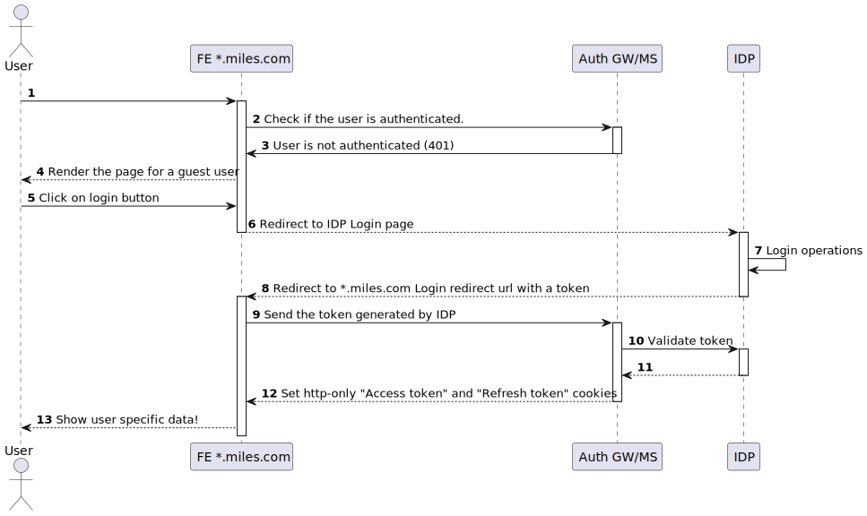

# Miles Case study

A suite of separate single-page applications where each one lives on a subdomain with a common parent domain.

* app1.miles.com
* app2.miles.com

We want to avoid customers having to sign in to each app separately. Similarly, signing out of one would sign out the others.

In this case study a solution for this case is investigated.

## Storing the token

There are 3 possible ways when it comes to storing the token,

1. `localstorage`: We cannot use this method on this case study, as `localstorage` is bound to each SPA. Also one might argue that `localstorage` is vulnrable to XSS attacks.
2. `cookies`: cookies look like an option to store the authentication token. By setting `SameSite` propertry to `lax`, a cookie could be shared among all subdomains, however, cookies are also vulnrable to XSS attacks.
3. `http-only cookies`: by setting `http-only` property of a cookie while sending it to the frontend, the browser will block the frontend application access to it, therefore this looks like the way to go.

## IDP (Identity service provider)

Since we're tasked to have single sign on (SSO) for a couple of frontend applications, we should select an IDP. 
That said there are a few ready made solutions out there like Auth0, OneLogin, Okta, FusionAuth, etc. Nearly all of these IDPs are built on top of OpenID Connect or SAML. 

For this case study, for the sake of being able to explain everything to the rock bottom, it will be kept abstract and will be referred to as IDP service provider.

### login flow

The following sequence diagram demonstrates the flow when the user is not logged in.

* **Step 1**: The user opens the application and on page-render, the application should check whether the user is already authenticated or not.

* **Step 2**: In a `useEffect` hook on application init, it calls the Auth gateway application.

> Auth gateway application is a backend application that supports our frontend application for setting http-only cookies for the access and refresh token.

* **Step 3**: Since no cookie is set (or the tokens are invalid), the Auth gateway application will return a 401 (unauthenticated) response.

* **Step 4**: The frontend application intreprates the response and renders the page for a guest (unauthenticated) user.

* **Step 5**: Let's assume the user wants to login and clicks on the Login Button.

* **Step 6**: The frontend application should redirect the user to the IDP. at this stage depending on the IDP, the frontend application should provide the IDP with a set of information so the IDP knows where to redirect back the user in case of successful login.

> As an example *Auth0* has a SDK in place, that should be configured with a `client ID` and a `domain`, so the SDK can generate the redirect url with a set of query parameters (like `state`) to let *Auth0* know for which application the authentication is happening.
>
> Note that using a 3rd party like *Auth0* requires some prep work, to register the applications (Provide login callback URL, Logout call back URL, and web origins)

* **Step 7**: The user fills in the credentials on the IDP login page, the IDP makes sure the crednetials are correct and will redirect the user to the provided Login URL.

> Note that this step is beyond the scope of this case study. That said this step could be done in another Frontend application under `miles.com` in which will slightly change the flow and potentially can merge the Auth Gateway and IDP.

* **Step 8**: The user redirects to the provided login URL with a token signed by IDP.

> In case the IDP supports `Oauth2` the token is a JWT with some claims (Information).

* **Step 9**: The Frontend application should call the Auth GW with the received token seeking the user information and http-only cookie.

* **Step 10/11**: The Auth gateway application calls the IDP to validate the token.

> In case we use *Auth0* as IDP, it can generate the http-only cookies as well.
>
> Note that if the signed token follows `Oauth2` (or in the other word, the token is a JWT signed by an asymetic cryptography algorithm) the Auth gateway can potentially skip steps 10 and 11, as it can validate the token on its own.

* **Step 12**: The Auth gateway sets the http-only tokens with `SameSite` parameter set to `lax` and could potentially provide the Frontend application with the user related data.

*  **Step 13**: The frontend application renders user specific data.

### log out flow

The following diagram is a sequence diagram that shows the logout flow

In this diagram on **Step 7** Auth gateway is responsible for deleting the http-only authentication cookie. Since the cookie is deleted, the user will logout of all other subdomains as well as current one.
